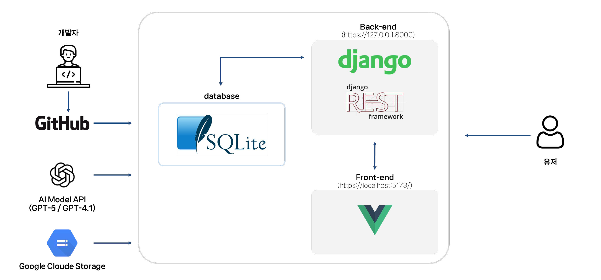
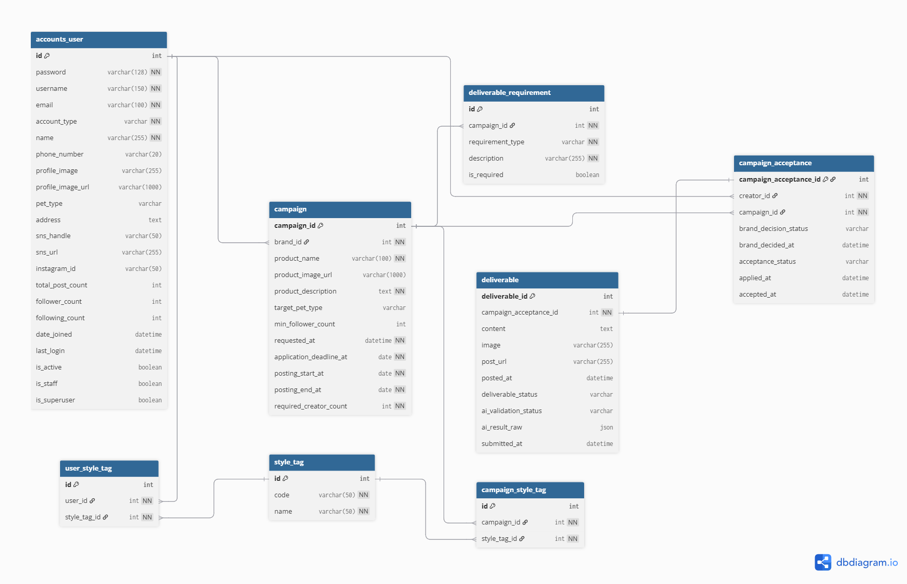

# Pawfecto 🐾

Pawfecto는 펫 브랜드와 반려동물 인플루언서를 연결하는  
캠페인 기반 마케팅 중개 플랫폼입니다.

브랜드는 캠페인을 생성하고 적합한 크리에이터를 추천·선정할 수 있으며,  
크리에이터는 캠페인 제안을 수락하고 콘텐츠를 제출할 수 있습니다.

## 📖 기획 배경

기존 펫 마케팅은 브랜드가 인플루언서를 직접 탐색하고
개별적으로 연락해야 하는 비효율적인 구조를 가지고 있습니다.

Pawfecto는
- 스타일 태그 기반 크리에이터 매칭
- 캠페인 진행 상태의 체계적 관리
- 콘텐츠 요건 AI 자동 검증

을 통해 브랜드와 크리에이터 모두의 부담을 줄이는 것을 목표로 합니다.

## ✨ 주요 기능

### 👤 브랜드
- 캠페인 생성, 수정 및 삭제
- 반려 동물 타입, 팔로워 수, 스타일 태그 기반 크리에이터 추천
- 크리에이터 승인 / 거절
- 캠페인 진행 현황 관리

### 🎥 크리에이터
- 캠페인 오퍼 목록 
- 오퍼 받은 캠페인 내용 상세 조회
- 오퍼 수락 / 거절
- 게시글 콘텐츠 및 이미지 저장

### 🤖 AI 검증
- 캠페인별 요구 조건에 따른 콘텐츠 검증
- 이미지/텍스트 조건 충족 여부 판단


## 🛠 기술 스택

### Backend
- Django
- Django REST Framework
- JWT Authentication

### Frontend
- Vue 3
- Pinia
- Axios

### Database
- Sqlite3

### AI
- 콘텐츠 검증 로직 (확장 가능 구조)

## 🏗 시스템 아키텍처 & ERD
### System Architecture


### ERD (Entity Relationship Diagram)


## 🚀 실행 방법 (Getting Started)
### **Installation**
- **mkcert**
    - https://github.com/FiloSottile/mkcert/releases 에서 `mkcert-v1.4.4-windows-amd64.exe` 다운로드
    - 파일명을 `mkcert.exe` 로 변경
    - Window PowerShell 관리자 권한으로 실행하기
       -  C:\Program Files\에 mkcert 폴더 생성 && 이동
       ```shell
        # 버전 확인 
        .\mkcert.exe -version
            
        # 설치
        .\mkcert.exe -install
       ```
- **django**
    ```bash
    pip install django-sslserver
    ```
    **서버 오픈 시**
    ```bash
    python manage.py runserver_plus \
    --cert-file certs/local-cert.pem \
    --key-file certs/local-key.pem
    ```
- **Vue**
    ```bash
    npm add -D @vitejs/plugin-basic-ssl
    ```

### Backend
```bash
cd pawfecto-backend/
python -m venv venv
source venv/Scripts/Activate
pip install -r requirements.txt
python manage.py makemigrations
python manage.py migrate
python manage.py runserver_plus \
  --cert-file certs/local-cert.pem \
  --key-file certs/local-key.pem
```

### Frontend
```bash
cd pawfecto-frontend
npm install
npm run dev
```

### 테스트 데이터
```bash
python manage.py loaddata myapp/fixtures/styletags.json
python manage.py loaddata accounts/fixtures/users.json
python manage.py loaddata accounts/fixtures/accounts_user_style_tags.json
python manage.py loaddata myapp/fixtures/campaign.json
python manage.py loaddata myapp/fixtures/campaign_acceptance.json
python manage.py loaddata myapp/fixtures/deliverable_requirements.json
python manage.py loaddata myapp/fixtures/deliverable.json
```

## 👨‍👩‍👧‍👦 팀원 소개 (Team Members)

| 이름 | 역할 | Github | 담당 기능 |
| :---: | :---: | :---: | :--- |
| <span style="white-space:nowrap;"><b>홍지운</b></span> | Team Leader | [@qqjiwoon](https://github.com/qqjiwoon) | 프로젝트 기획 및 설계, ERD 설계, API 설계, 크리에이터 대시보드 디자인 및 브랜드 대시보드 구현, AI 연결 및 기능 구현|
| <span style="white-space:nowrap;"><b>전주연</b></span> | Team Member | [@jeonjy99](https://github.com/jeonjy99) | 프로젝트 기획 및 설계, API 설계, 브랜드 대시보드 디자인 및 크리에이터 대시보드 구현, AI 연결 및 기능 구현 |